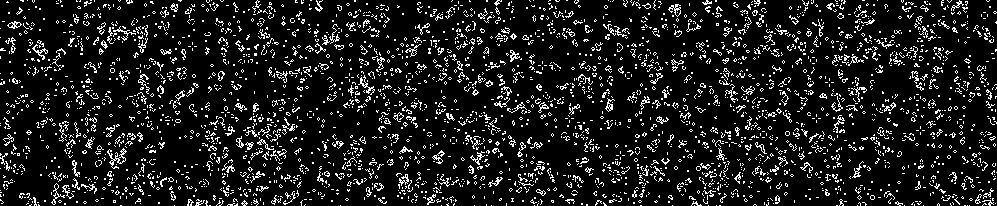
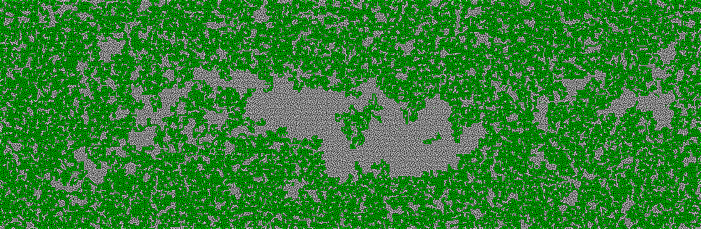
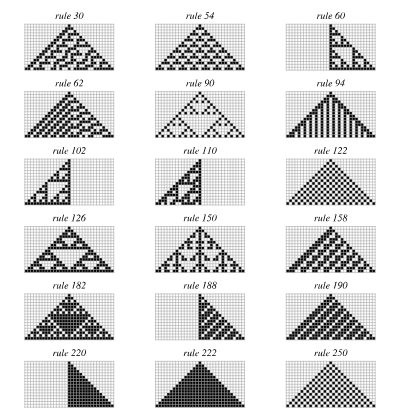

# C++ Playground

Personal project where I like to play around with C++ and create interesting graphic visuals.

## Content

### Dots

An in between of particle/ant simulation. It uses SIMD optimizations to allow for a large number of dots. I can run 1,500,000 dots at 60fps on my machine.

**Fun fact**: Multithreading the simulation makes it slower. My best guess as to why this is, is cache misses.

Feel free to play around with the settings. I always like to increase the Max Speed.

**Controls:**
- Left click to attract dots.
- Right click to repel dots.

Watch on YouTube: (Sorry for the youtube compression)

  

### Game of Life

Everyone knows this right?

It uses your whole screen to simulate the game of life. You can change the speed by changing the FPS value.

### Maze

A simple maze generator using the recursive backtracking algorithm. IT again uses your whole screen. if ``Keep longest path`` is enabled, it will show the longest/hardest path to solve the maze.

**Controls:**
- Click anywhere on the screen, This will be the starting point of the maze.
- Lower the ``Steps per frame`` to see the generation process.
- 

### Wolfram

An implementation of the Wolfram cellular automaton. You can change the rule by changing the ``Rule`` value.

Check this [page](https://mathworld.wolfram.com/ElementaryCellularAutomaton.html) to see cool patterns you can make.

### Verlet

Circle physics simulation that tries to simulate water.

Feel free to play around with the settings.

**Settings:**
- Spawn count: how may circles to spawn. When clicking the ``spawn`` button.
- Spawn size: the size of the circles. Dont put it below 0.5 or it might take some time calcualte/
- Circle Constrain: toggle this to make the particles stay in a circle.
- Draw Grid bool: a debug grid to see in which cell the particles are.

**Controls:**
- Left click to attract particles.
- Right click to repel particles.

### Circles

A sine wave circle visualization.

### Drawing

A circle that keeps getting divided into smaller circles.

**Controls:**
- Left click on circle to divide it.
- Scroll to zoom in/out.
- Z to scroll in.

## How to run

- Download the project and open the .sln file in Visual Studio.
- Run the ``voxpopuli`` project with Release on x64.

## Credits

Starting point for this project is the [Voxpopuli](https://github.com/jbikker/voxpopuli) made by my teacher [Jacco Bikker](https://github.com/jbikker).